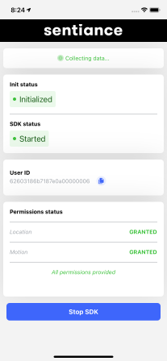
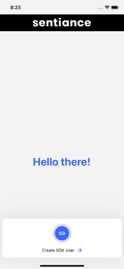

# Sample React Native Application

This is a sample application to demonstrate how to integrate the Sentiance in both android and iOS SDK.

 

## What's in this?

In this sample application we cover

1. SDK Integration - with user linking
2. Helper methods for quick and easy SDK integration

## getCredentials

This method queries the sample "api" to fetch the
SDK credentials and initializes the Sentiance SDK

## handleCreateUser

handleCreateUser method requires SDK credentials, and we recommend that you don't store the credentials in the application codebase. Therefore we created a sample api server which returns the SDK credentials.
This sample api server also demonstrates the user linking workflow as well. Ensure the sample api server is running before launching the sample app.

If you have any queries please write to support@sentiance.com or create a Github issue and we shall help you out!
