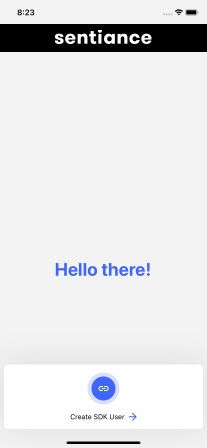
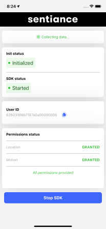

# Sample React Native Application

This is a sample application to demonstrate how to integrate the Sentiance SDK in with react-native mobile application.

 &nbsp; 

## What's in this?

In this sample application we cover the SDK Integration (and SDK user creation) - with [user linking](https://docs.sentiance.com/important-topics/user-linking-2.0)

There are four places you need to look at

1. `initializeSentianceSDK` in the `AppDelegate.m`. // iOS native async initialization
2. `initializeSentianceSDK` in the `MainApplication.java`. // Android native async initialization
3. `Initialization/index.tsx`. // awaits `SentianceCore.ensureInitialized()` before showing the app, and surfaces init failures
4. `handleCreateUser` in the `Home/index.tsx`. // sentiance user creation

## To run this project:

1. Request a developer account by [contacting Sentiance](mailto:support@sentiance.com).
2. Setup your backend to provide authentication code to Application. See: [**sample api server**](https://github.com/sentiance/sample-apps-api)
3. In `package.json` update the [`@sentiance-react-native/core`](https://github.com/sentiance/react-native-sentiance) dependency version to the latest one.
4. Update the `BASE_URL` in `constants.ts` to get authentication code from your server.
5. Install pnpm `npm install -g pnpm`
6. Run `pnpm i` to install the dependencies.
7. Run `pod install` inside iOS project directory.
8. Run iOS / Android apps using cmd or Android Studio / Xcode.

## More info

* [Full documentation on the Sentiance SDK](https://docs.sentiance.com/)
