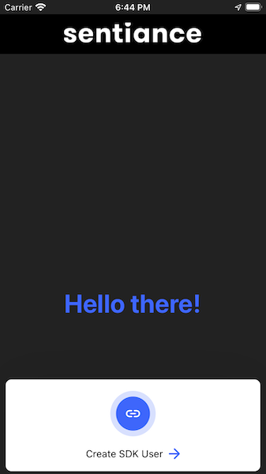
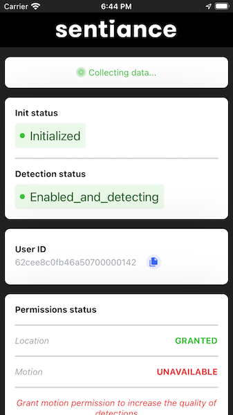

# Sample React Native Application

This is a sample application to demonstrate how to integrate the Sentiance in both android and iOS SDK.

 &nbsp; 

## What's in this?

In this sample application we cover

1. SDK Integration - with user linking
2. Helper methods for quick and easy SDK integration

## Initialization

For iOS initialization go inside ios folder then look for **RNSentiance** inside AppDelegate.m
For android initialization go inside android folder then look for **RNSentianceHelper.getInstance(getApplicationContext())** inside MainApplication.java

## Create User SDK

Inside home.tsx look for **handleCreateUser** method that requires SDK credentials, and we recommend that you don't store the credentials in the application codebase. Therefore we created a sample api server which returns the SDK credentials.
This sample api server also demonstrates the user linking workflow as well. Ensure the sample api server is running before launching the sample app.

## SDK and Init status

Inside dashboard.tsx we are calling **RNSentiance.getInitState()** and **RNSentiance.getSdkStatus()** to know about the status of SDK whether it's initialized or in pending state.

If you have any queries please write to support@sentiance.com or create a Github issue and we shall help you out!
